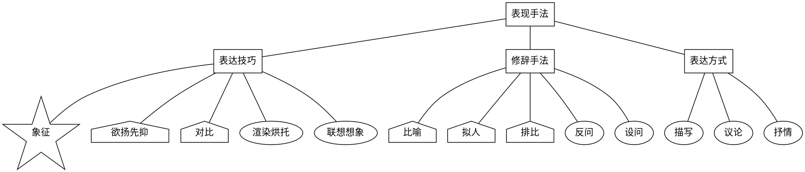
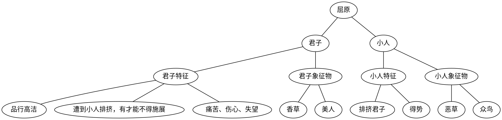

# 现代文表现手法

表现手法 = 手法 = 表达技巧 = 写法 = 手法 = 表达效果 = 表达方式 = 表现特色

总之题目中“表”字开头，“法”字结尾的词大都指的是表现手法。

## 手法分类与区分

把所有手法背下来，答题的时候选一个？别做梦了！你不是神！其实没有必要全背下来！这张图越往左越重要。表达方式是最熟悉的，天天用，不考；修辞手法比喻拟人作用背烂了，不太重要；表达技巧中你最不熟悉的内容那就最要考你！你只需要关注六种重点手法即可：

* 象征
* 对比
* 欲扬先抑
* 比喻
* 拟人
* 排比

问“哪个手法”，三选一；问“哪些手法”，从六个里面排除。

### 手法区分

你必须把概念理解，弄懂！才能用得上！

表达技巧：表达有两种：粗鄙浅陋直白的；含蓄委婉的。表达技巧就是使表达由直白变含蓄的技巧。

三组易混淆手法：

* 联想：有根据的，有线索的想
* 想象：天马行空地

* 衬托 = 对比：同种事物之间
* 烘托：不同种事物之间

* 比喻：用一个具体的物来描述另一个一个具体的物
* 象征 = 即托物言志：用一个具体的物来描述一个抽象概念

借代：以部分代整体

## 中文最重要的手法——象征

象征是汉语世界中最重要的手法。

### 诗歌

象征在古诗特别重要，叫托物言志，象征诗很独特，不好翻译。

#### 象征诗祖宗屈原

#### 屈原的孙子们

写象征诗都逃不开屈原的框架。凡是用物做题目或题目有“咏”字的都是象征诗。

孙子们还是让君子干这三件事，小人干这两件事。只是用来象征的物变了：一般用凤凰象征君子，相对应地用众鸟、燕雀来象征小人，用日、太阳来象征君主，相对应的用落日余晖、浮云这些遮蔽太阳的东西来象征小人。

不熟悉的诗人你开心找祖宗即可；熟悉的诗人你反而得紧张，很可能他这次换风格了！

### 象征的四点好处

非常关键！最多四条，前三条相似，但是都有老师出出来作为答案，标准答案往往 2 ~ 4 条不等，所以最好还是把能答的都答上。

1. 含蓄抒情
2. 使主旨<具体写出>表达得含而不露、隐而不晦、韵味悠长
3. 增强文章的艺术感染力
4. <象征物>构成文章线索

## 其他手法的好处

### 对比

强调突出

### 欲扬先抑

1. 激发读者阅读兴趣
2. 为下文描写铺垫感情

### 比喻拟人

生动、形象

### 排比

层层深入、加强语势
